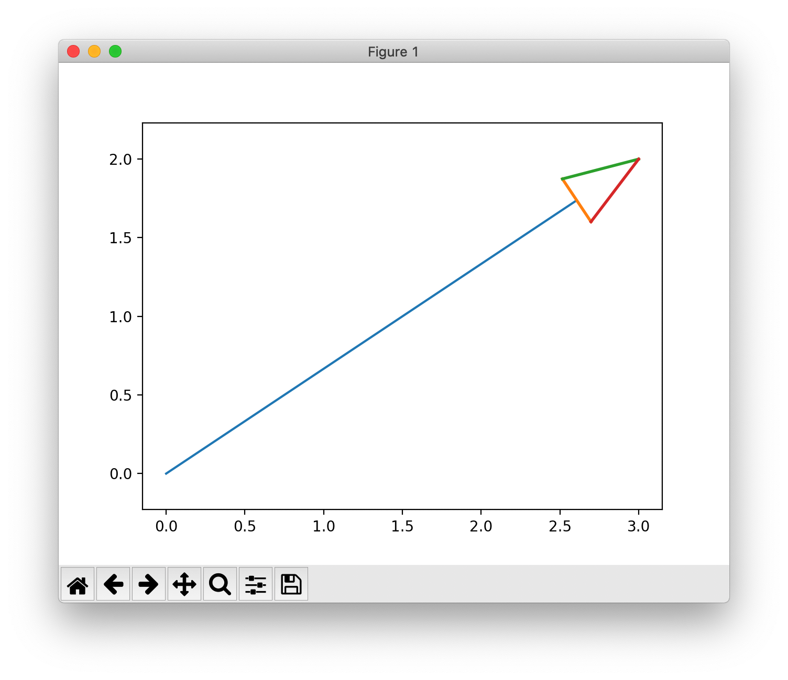
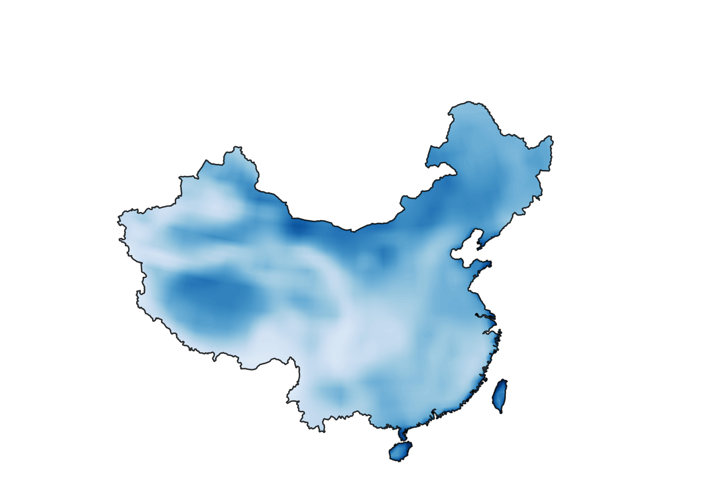

# Have Fun!!!
### [1. 中国地图、白化](https://github.com/fhhan/eg/blob/master/cartopy_makeout.py)
```python
# maskout 中国地图
countries = shp.records()
cn_multipoly, = [country.geometry for country in countries
                 if country.attributes['CNTRY_NAME'] == 'China']  # 选择地图属性下'NAME'属性里名字是'China'的一条多边形

paths = []
for i in range(len(cn_multipoly)):
    cn_geom, = geos_to_path(cn_multipoly.geoms[i])
    paths.append(cn_geom)

path = Path.make_compound_path(*paths)
for collection in contourf.collections:
    collection.set_clip_path(path, proj._as_mpl_transform(ax))
 ```   


---
### [2. 绘制箭头](https://github.com/fhhan/eg/blob/master/my_quiver.py)


---
### [3. 透明图层](https://github.com/fhhan/eg/blob/master/transparent.py)
```python
ax.background_patch.set_visible(False)   #设置图片背景为不可见
ax.outline_patch.set_visible(False)      #设置图片外面的outline方框
#设置图片透明度
alpha = 0
fig.patch.set_alpha(alpha)
ax.patch.set_alpha(alpha)
fig.savefig('transparent.png',bbox_inches = 'tight',transparent=True)
 ``` 

